# 🏥 Agenda Cita Médica - Flujo Completo

Este documento describe el flujo completo de procesamiento de una cita médica, desde la recepción de la petición hasta la actualización final del estado en DynamoDB.

## 🚦 Pasos del Flujo

1. **Recepción y registro inicial**
   - La petición es recibida por un **lambda** (`appointment`) que guarda la información en una tabla de **DynamoDB** con el estado `"pending"`.

2. **Publicación en SNS**
   - El **lambda** (`appointment`) envía la información a un **SNS**.  
   - Debe haber un tópico por país o, en su defecto, se utiliza un filtro por país.

3. **Enrutamiento a SQS**
   - El **SNS** envía la información al **SQS** correspondiente.  
   - Por ejemplo, si el `countryISO` es `PE`, la información se envía a la cola **SQS_PE**.

4. **Procesamiento por país y guardado en RDS**
   - El **lambda** correspondiente (`appointment_pe` o `appointment_cl`) lee la información del **SQS** y la almacena en una base de datos MySQL (**RDS**) del país correspondiente.

5. **Confirmación vía EventBridge**
   - Los **lambdas** (`appointment_pe` y `appointment_cl`) envían la conformidad del agendamiento a través de **EventBridge**.
   - EventBridge reenvía este evento a un **SQS** de estado.

6. **Actualización final en DynamoDB**
   - El **lambda** `appointment` lee la información del **SQS** de estado y actualiza el estado de la cita a `"completed"` en la tabla de **DynamoDB**.
---
### Diagrama de Arquitectura



---
## 📁 Estructura relevante

- [`src/appointment/handler.ts`](src/appointment/handler.ts): Lambda principal para recepción y actualización de estado.
- [`src/appointment_pe/handler.ts`](src/appointment_pe/handler.ts): Lambda para procesamiento de Perú.
- [`src/appointment_cl/handler.ts`](src/appointment_cl/handler.ts): Lambda para procesamiento de Chile.
- [`src/appointment_pe/infrastructure/rds/DateRdsRepository.ts`](src/appointment_pe/infrastructure/rds/DateRdsRepository.ts): Repositorio RDS Perú.
- [`src/appointment_cl/infrastructure/rds/DateRdsRepository.ts`](src/appointment_cl/infrastructure/rds/DateRdsRepository.ts): Repositorio RDS Chile.

---

## 📦 Instalación y despliegue

1. **Clona el repositorio:**
   ```bash
   git clone https://github.com/imjowend/agenda-cita-medica.git
   cd agenda-cita-medica
   ```

2. **Instala las dependencias:**
   ```bash
   npm install
   ```

3. **Configura las variables de entorno** en un archivo `.env` según el país y recursos.

4. **Despliega con Serverless Framework:**
   ```bash
   npx serverless deploy --stage dev
   ```

---

## 🧪 Pruebas

Para ejecutar los tests unitarios:

```bash
npx jest
```

---

## 🗂️ Ejemplo de evento SQS

```json
{
  "insuredId": "i1",
  "scheduleId": 123,
  "countryISO": "PE"
}
```

---

## 📞 Contacto

[imjowend](https://github.com/imjowend)
